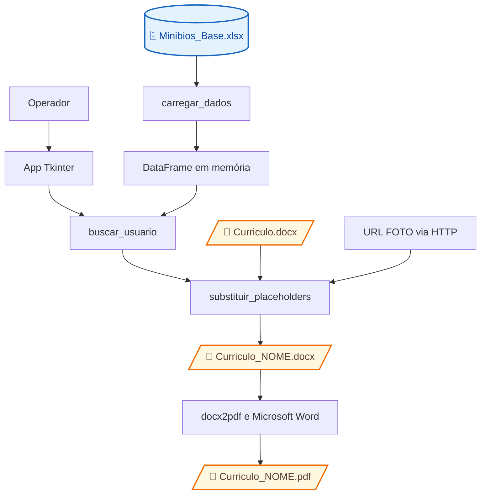

# Arquitetura e lógica de uso

## Estrutura verificada

| Arquivo | Responsabilidade |
| --- | --- |
| `Gerador_de_Curriculo.py` | Ponto de entrada, GUI, leitura Excel, busca, preenchimento Word e conversão PDF |
| `requeriments.txt` | Dependências sem versões fixadas: pandas, openpyxl, python-docx, requests e docx2pdf |
| `README.md` | Orientações anteriores de instalação e uso; divergências registradas na avaliação técnica |
| `Guia do Gerador de Currículos - Automatizador da Geração de Currículos.pdf` | Guia existente; conteúdo não inspecionado |
| `docs/` e `mkdocs.yml` | Documentação e apresentação local |

Não foram encontrados testes ou arquivos de empacotamento entre os arquivos versionados. `Minibios_Base.xlsx` e `Curriculo.docx` são entradas esperadas pelo código, não arquivos versionados disponíveis nesta auditoria.

## Componentes e integrações



### Responsabilidades principais

- `carregar_dados` (linhas 28–37): lê o Excel e converte a coluna de busca para texto; qualquer exceção retorna `None`.
- `buscar_usuario` (39–44): comparação exata de código e seleção da primeira linha correspondente.
- `processar_paragrafo` / `substituir_placeholders` (47–91): substituições de texto e foto nos parágrafos alcançados pelo percurso do documento.
- `App` (95–206): monta a interface, carrega a base na inicialização e coordena cada geração em `on_gerar_click`.
- Bloco `__main__` (209–213): cria `Tk`, instancia `App` e inicia `mainloop`.

A execução é síncrona na thread da interface. `update_idletasks()` atualiza a apresentação, mas não transforma leitura, download ou conversão em tarefas de fundo. O DataFrame permanece em memória até o fechamento; não há recarga pela interface. Não há serviço web ou banco de dados no código inspecionado.

## Requisitos e caminhos

- Ambiente Python com Tkinter e as dependências de `requeriments.txt`.
- Microsoft Word instalado para a conversão via `docx2pdf`, conforme requisito do README.
- Tema Tk `vista`, solicitado sem fallback em `App.__init__`: há dependência de ambiente compatível, tipicamente Windows.
- Base Excel com `CODIGO_LC` e `NOME`; `FOTO` é opcional para o código. Outras colunas são aproveitadas quando há placeholders correspondentes.
- Modelo `Curriculo.docx` com tags compatíveis; detalhes em [fluxo dos dados](data-lineage.md).
- Acesso de leitura às entradas e escrita no diretório de trabalho; rede é usada quando a foto tem URL cujo texto começa com `http`.

Os nomes de entrada e saída são relativos ao **diretório de trabalho do processo**, não resolvidos pela localização do script ou do executável. Executar a partir da pasta que contém as entradas evita essa ambiguidade. A receita de empacotamento e o diretório de trabalho do executável informado não são conhecidos.

## Sequência de uso implementada

Os comandos abaixo são orientações; não foram executados na auditoria.

1. Prepare a base e o modelo no diretório de trabalho. A primeira aba do Excel é lida, com cabeçalhos padrão do pandas.
2. No ambiente Python destinado ao aplicativo, instale as dependências usando o nome real do arquivo:

   ```powershell
   python -m pip install -r requeriments.txt
   python Gerador_de_Curriculo.py
   ```

3. Aguarde a mensagem de base carregada. Se a carga falhar, a interface informa erro crítico e solicita encerramento do loop.
4. Digite `CODIGO_LC` e clique em **Gerar Currículo** ou pressione Enter. A interface não permite editar os campos do currículo.
5. O programa busca o registro, abre o modelo, preenche os campos, salva DOCX e converte para PDF.
6. No sucesso, mostra os dois nomes gerados. Após a tentativa processada, limpa a entrada e reabilita o botão.
7. Confira manualmente os documentos. Não há etapa de revisão/aprovação obrigatória implementada.

Alterações na planilha exigem reiniciar o aplicativo para nova leitura; o modelo é aberto novamente a cada geração. Os arquivos finais são conservados no disco, inclusive o DOCX salvo antes de uma eventual falha na conversão.
