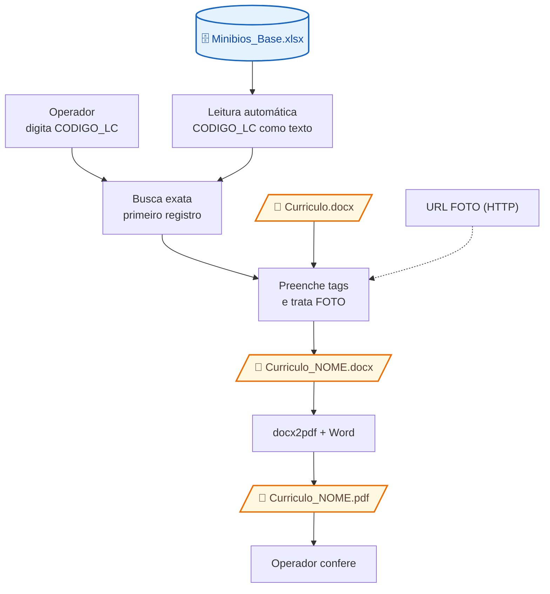

# Fontes, transformações e destinos

## Fluxo e modalidades

O operador fornece o código e aciona a geração. A manutenção da planilha, do modelo e das URLs é externa ao aplicativo; seus responsáveis e procedimentos não foram verificados. Busca, substituição, download e conversão são automáticos após o acionamento. Não existem campos para edição manual do currículo na GUI, nem cálculo de qualificações, resumo por IA ou aprovação automatizada.

## Decisões e falhas

| Condição | Comportamento verificável |
| --- | --- |
| Excel ausente, coluna de busca ausente ou outra falha de leitura | `carregar_dados` retorna `None`; GUI mostra erro crítico genérico |
| Código vazio após trim | Aviso; não inicia a geração |
| Nenhuma correspondência | Erro de não encontrado; interface é reinicializada |
| Mais de uma correspondência | Usa a primeira, sem aviso de duplicidade |
| Valor comum ausente | Substitui a tag correspondente por vazio; `CODIGO_LC` já foi convertido para string na carga |
| `NOME` inexistente | Acesso direto falha; tratado como erro inesperado |
| Foto ausente, URL sem prefixo esperado ou falha HTTP/imagem | Remove `[FOTO]` inteiro do run; pode concluir o currículo sem foto e sem aviso |
| `PermissionError` | Mensagem de permissão negada; recomenda fechar arquivos abertos |
| `FileNotFoundError` na geração | Mensagem atribui o problema ao template, independentemente da etapa real |
| Exceção com texto contendo `pywintypes.com_error` | Mensagem específica de conversão; identificação depende do texto da exceção |
| Outra exceção | Mostra erro inesperado; não há rollback dos arquivos já salvos |

## Limites de verificação

Zeros à esquerda e representação de números podem ser afetados pela inferência do Excel/pandas antes de `astype(str)`; o efeito depende dos dados reais e não foi testado. Layout final, imagens, correspondência de campos e fidelidade da conversão permanecem não verificados sem entradas sintéticas autorizadas e ambiente Word.
